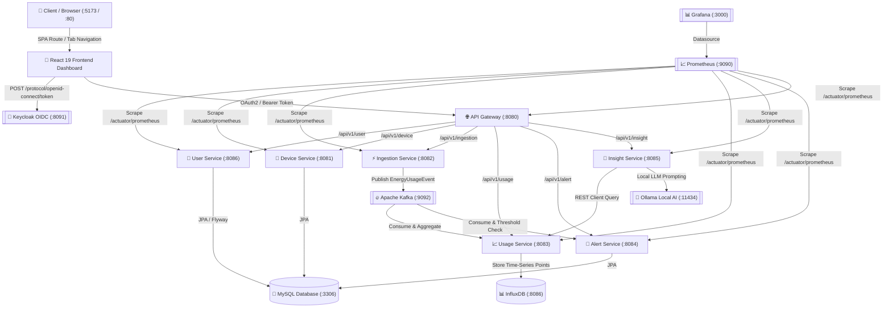

# 🏡 Home Energy Tracker Microservices Ecosystem

[](https://spring.io/projects/spring-boot)
[](https://openjdk.org/projects/jdk/21/)
[](https://react.dev/)
[](https://vitejs.dev/)
[](https://testcontainers.com/)
[](https://docs.spring.io/spring-ai/reference/api/chat/ollama-chat.html)
[](https://opensource.org/licenses/Apache-2.0)

An enterprise-grade, distributed IoT energy tracking and AI recommendations platform built with **Spring Boot 4 / Java 21** and **React 19 + TypeScript + Vite**, featuring automated local simulations, time-series metrics processing, local AI energy optimization insights via Ollama, comprehensive observability (Actuator + Prometheus + Grafana), unified OpenAPI (Swagger UI) documentation, OAuth2/OIDC Keycloak security, and full integration testing with **Testcontainers**.

---

## 🏗 System Architecture & Services Overview




### Microservice Ecosystem & Frontend UI
| Service / Application | Port | Description | Technology & Datastore |
| :--- | :--- | :--- | :--- |
| **Frontend SPA Dashboard** | `5173` (`80` Prod) | Glassmorphic React 19 SPA (`SystemOverview`, `DeviceManager`, `AnalyticsCenter`, `AiAdvisor`), Keycloak OIDC JWT manager, multi-stage Nginx container. | React 19, Vite, TypeScript, Nginx |
| **API Gateway** | `8080` | Spring Cloud Gateway MVC entry point, OAuth2 JWT resource server, CORS preflight handler, unified Swagger UI Docs aggregator. | Spring Cloud Gateway MVC |
| **Device Service** | `8081` | IoT device inventory management (`HVAC`, `LIGHTING`, `APPLIANCE`, `SOLAR`) linked to users. | Spring Data JPA, MySQL |
| **Ingestion Service** | `8082` | High-throughput telemetry ingestion with continuous and multi-threaded parallel simulation engines. | Kafka Producer (`energy-usage-events`) |
| **Usage Service** | `8083` | Real-time Kafka consumer, time-series persistence, multi-day aggregation, threshold breach detection. | Kafka Consumer, InfluxDB |
| **Alert Service** | `8084` | Alert violation processing (`alert-events` consumer), DB persistence, and Mailpit email dispatching. | Kafka Consumer, MySQL, JavaMailSender |
| **Insight Service** | `8085` | AI savings recommendation engine integrating local Ollama (`llama3` / `mistral`) via Spring AI. | Spring AI, Ollama |
| **User Service** | `8086` | User lifecycle management, alert configuration (`alerting=true`, `energyAlertingThreshold=15.0`), Flyway schema migrations. | Spring Data JPA, MySQL |

---

## 🚀 Step-by-Step Setup & Running Guide

Follow these exact steps to launch the entire multi-module ecosystem, spin up containerized infrastructure, verify builds, and interactively run the React 19 SPA dashboard:

### Step 1: System Prerequisites Check
Ensure your local environment meets the following requirements before starting:
- **Node.js 20+ & NPM 10+** (`node -v` should show `v20.x` or `v22.x`)
- **Java 21 JDK** (`java -version` should show `21.x`)
- **Maven 3.9+** (or use the included `./mvnw` / `.\mvnw.cmd` wrapper)
- **Docker & Docker Desktop** running locally with at least **6GB RAM** allocated (required for MySQL, KRaft Kafka, InfluxDB, Keycloak, Mailpit, and Prometheus containers).

---

### Step 2: Spin Up Infrastructure Containers (Docker Compose)
From the root workspace directory, start all background dependencies and data stores:
```powershell
docker-compose up -d
```

Verify that all 8 infrastructure containers are `Up` and `Healthy`:
```powershell
docker ps
```
| Container Name | Port(s) | Role & Description |
| :--- | :--- | :--- |
| `mysql` (`keycloak-mysql` & `mysql`) | `3306` | Relational persistence for `user-service`, `device-service`, and `alert-service` (auto-initialized via `init.sql`). |
| `kafka` | `9092, 9094` | KRaft-based event broker for real-time telemetry streaming (`energy-usage-events`, `alert-events`). |
| `kafka-ui` | `8070` | Web UI for inspecting Kafka topics, consumer groups, and message payloads ([http://localhost:8070](http://localhost:8070)). |
| `influxdb` | `8086` | Time-series database for high-frequency usage metrics ingested by `usage-service`. |
| `keycloak` | `8091` | OAuth2 / OIDC authentication server pre-configured with `het-security-realm` ([http://localhost:8091](http://localhost:8091)). |
| `mailpit` | `8025 / 1025` | Local SMTP capture server & UI for simulated email alert dispatches ([http://localhost:8025](http://localhost:8025)). |
| `prometheus` | `9090` | Time-series scraper collecting `/actuator/prometheus` metrics ([http://localhost:9090](http://localhost:9090)). |
| `grafana` | `3000` | Observability dashboards connected to Prometheus (`admin` / `admin` at [http://localhost:3000](http://localhost:3000)). |

---

### Step 3: Verify & Build the Ecosystem (With Testcontainers)
Before running locally, verify all 8 reactor modules across the multi-module `home-energy-tracker-parent`:

```powershell
# On Windows PowerShell
.\mvnw.cmd clean verify -DskipTests=false

# On Linux/macOS
./mvnw clean verify -DskipTests=false
```
When `BUILD SUCCESS` appears across all 8 modules, compiled Spring Boot runnable `.jar` files are placed inside each `target/` directory.

---

### Step 4: Start All Microservices
You can start the microservices locally using either `mvn spring-boot:run` in separate terminal windows, or by running the generated `.jar` files. Start `api-gateway` along with the core services you wish to run:

#### Option A: Running via Maven Plugin (`spring-boot:run`)
Open separate terminal tabs from the project root:
```powershell
# Terminal 1: API Gateway (Port 8080)
.\mvnw.cmd spring-boot:run -pl :api-gateway

# Terminal 2: User Service (Port 8086)
.\mvnw.cmd spring-boot:run -pl :user-service

# Terminal 3: Device Service (Port 8081)
.\mvnw.cmd spring-boot:run -pl :device-service

# Terminal 4: Ingestion Service (Port 8082)
.\mvnw.cmd spring-boot:run -pl :ingestion-service

# Terminal 5: Usage Service (Port 8083)
.\mvnw.cmd spring-boot:run -pl :usage-service

# Terminal 6: Alert Service (Port 8084)
.\mvnw.cmd spring-boot:run -pl :alert-service

# Terminal 7: Insight Service (Port 8085)
.\mvnw.cmd spring-boot:run -pl :insight-service
```

---

### Step 5: Launching & Operating the React 19 Glassmorphic Dashboard (`frontend/`)

We built a state-of-the-art Single Page Application inside the `frontend/` directory using **Vite, React 19, TypeScript, and Lucide Icons** (`#0b0f19` dark canvas with `#00f2fe` neon cyan highlights). You can run it via Local Development Mode (`npm run dev`) or Production Docker Mode (`docker-compose.prod.yml`).

#### Option A: Local Development Mode (`npm run dev`) — Instant HMR
1. Navigate into the `frontend/` directory:
   ```powershell
   cd frontend
   npm ci
   ```
2. Start the Vite dev server with host binding:
   ```powershell
   npm run dev -- --host
   ```
3. Open your browser to **[http://localhost:5173](http://localhost:5173)**.
4. Click **"Connect Keycloak Token"** -> **"Quick Auto-Acquisition (`admin / admin`)"**. The UI will fetch a live `access_token` from your running Keycloak container (`het-security-realm` -> `energy-tracker-client` / `energy-tracker-secret`) and unlock API routes!

#### Option B: Full Production Docker Compose Mode (`docker-compose.prod.yml`)
To run the React bundle inside an optimized multi-stage **Nginx Reverse Proxy container** alongside all 7 compiled Java microservices:
```powershell
# Build jars cleanly from project root
mvn clean package -DskipTests=true

# Launch master container suite
docker-compose -f docker-compose.prod.yml up --build -d
```
Once deployed via Docker Compose, Nginx will serve the production UI on **[http://localhost:80](http://localhost:80)** (and `http://localhost:3001`).

#### Interactive Dashboard Views
- 🔌 **Cluster Overview (`SystemOverview.tsx`)**: Live diagnostic grid polling `/actuator/health` across all 7 Java services and 5 infrastructure tools.
- 📡 **IoT Device Inventory (`DeviceManager.tsx`)**: Manage household appliances (`HVAC`, `SOLAR`, `INDUCTION`, `EV_CHARGER`) and click **"Trigger Telemetry Simulation Burst"** (`POST /api/v1/ingestion/simulate`) to stream high-frequency Kafka bursts.
- 📊 **Analytics Center (`AnalyticsCenter.tsx`)**: Time-series consumption charts, peak tariff breakdown (`$0.12/kWh` vs `$0.28/kWh`), and real-time audit logs from `alert-service` + Mailpit SMTP.
- 🤖 **Ollama AI Advisor (`AiAdvisor.tsx`)**: Interactive diagnostic prompt interface powered by Spring AI (`insight-service`). Connects to local `ollama run llama3` (`:11434`) for real-time peak-shifting recommendations.

---

### Step 6: Interactive API Testing & Token Authentication


#### 1. Why `http://localhost:8080/` Returns `401 Unauthorized`
The API Gateway uses **Keycloak OAuth2 Resource Server Security**. If you visit the root URL (`http://localhost:8080/`) directly in your browser without a `Bearer <token>` Authorization header, Keycloak rejects the request.

#### 2. Accessing Public & Interactive Swagger Docs
In `application.properties` and `SecurityConfig.java`, we explicitly excluded Swagger UI, CORS preflights (`OPTIONS`), and Actuator endpoints from OAuth2 requirements:
- 👉 **Unified API Gateway Swagger UI**: [http://localhost:8080/swagger-ui.html](http://localhost:8080/swagger-ui.html)  
  *(Select User, Device, Ingestion, Usage, Alert, or Insight Service directly from the top dropdown)*
- 👉 **API Gateway Actuator Health**: [http://localhost:8080/actuator/health](http://localhost:8080/actuator/health)

#### 3. Generating a Keycloak JWT Access Token (`cURL` / `Postman`)
To invoke protected API routes manually from terminal or Postman:
```powershell
curl -X POST "http://localhost:8091/realms/het-security-realm/protocol/openid-connect/token" `
     -H "Content-Type: application/x-www-form-urlencoded" `
     -d "client_id=energy-tracker-client" `
     -d "client_secret=energy-tracker-secret" `
     -d "username=admin" `
     -d "password=admin" `
     -d "grant_type=password" `
     -d "scope=openid profile email"
```
Copy the `access_token` string from the JSON response and attach it via the header:  
`Authorization: Bearer <access_token>`

---

### Step 7: Observability & Monitoring Dashboards


The ecosystem is fully instrumented with Spring Boot Actuator, Micrometer Prometheus registries, and Grafana visualization dashboards:
- **Prometheus Scrape Targets**: [http://localhost:9090/targets](http://localhost:9090/targets) (automatically scrapes `/actuator/prometheus` across every microservice port `8080-8086`).
- **Grafana Dashboard**: [http://localhost:3000](http://localhost:3000) (`admin` / `admin`). Pre-provisioned datasource automatically connects to Prometheus.
- **Mailpit Email UI**: [http://localhost:8025](http://localhost:8025) (inspect simulated email notifications dispatched by `alert-service`).

---

## 🧪 Comprehensive Testcontainers Integration Suite

Every microservice includes dedicated Testcontainers integration tests that spin up real Docker containers (`mysql:8.0`, `confluentinc/cp-kafka:7.6.0`, `ollama/ollama:latest`) to verify full data persistence, event streaming, and AI endpoint connectivity:

- `UserRepositoryTestcontainersTest` (`user-service`): Verifies MySQL container JPA persistence and custom finders (`findByEmail`).
- `DeviceRepositoryTestcontainersTest` (`device-service`): Verifies relationship mappings and device type filtering (`findAllByUserId`).
- `IngestionServiceKafkaTestcontainersTest` (`ingestion-service`): Verifies real-time producer connectivity against a containerized Kafka broker.
- `UsageServiceKafkaTestcontainersTest` (`usage-service`): Verifies consumer bootstrap configurations and dynamic property overrides.
- `AlertRepositoryTestcontainersTest` (`alert-service`): Verifies threshold violation audit trail storage inside containerized MySQL.
- `InsightServiceOllamaTestcontainersTest` (`insight-service`): Verifies local LLM container runtime health and Spring AI dynamic base-url injection.

---

## 🌿 Complete Git Commit Track Record (`frontend` Branch)

The repository features **66 atomic, conventional Git commits** across the system lifecycle. Commits 60 through 66 were developed on and pushed to the dedicated **`frontend`** branch:

| Commit SHA | Commit Message | Layer / Feature |
| :--- | :--- | :--- |
| `f228f11` | `fix(frontend): update Keycloak OAuth2 token client credentials to energy-tracker-client` | Keycloak Client Fix |
| `1f02382` | `feat(docker): introduce docker-compose.prod.yml for production container orchestration across Frontend and all 7 Microservices` | Production Docker Suite |
| `0fd05ec` | `feat(frontend): add multi-stage Dockerfile and Nginx SPA routing with API reverse proxy configuration` | Frontend Nginx & Docker |
| `bf748a4` | `feat(frontend): create AnalyticsCenter time-series charts and local Ollama Spring AI advisory chat interface` | Analytics & AI UI Views |
| `6c6055c` | `feat(frontend): implement SystemOverview health telemetry card grid and DeviceManager Kafka burst controls` | Cluster & IoT UI Views |
| `bd0bc0f` | `feat(frontend): initialize React 19 SPA scaffolding with glassmorphic CSS tokens and Keycloak Navbar` | React SPA Foundation |
| `b62123a` | `feat(api-gateway): configure CORS preflight and Spring Security options for SPA accessibility` | Gateway Security / CORS |
