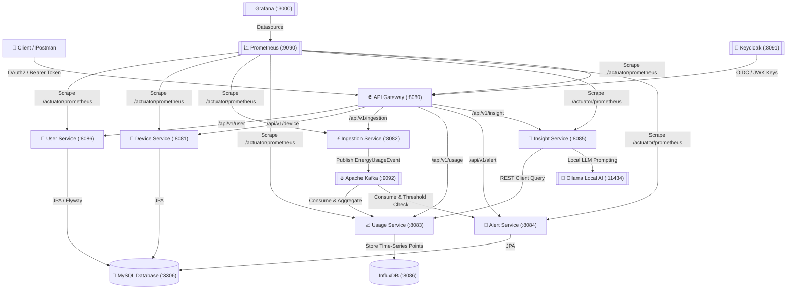

# 🏡 Home Energy Tracker Microservices Ecosystem

[](https://spring.io/projects/spring-boot)
[](https://openjdk.org/projects/jdk/21/)
[](https://testcontainers.com/)
[](https://docs.spring.io/spring-ai/reference/api/chat/ollama-chat.html)
[](https://opensource.org/licenses/Apache-2.0)

An enterprise-grade, distributed IoT energy tracking and AI recommendations platform built with **Spring Boot 4 / Java 21**, featuring automated local simulations, time-series metrics processing, local AI energy optimization insights via Ollama, comprehensive observability (Actuator + Prometheus + Grafana), unified OpenAPI (Swagger UI) documentation, OAuth2/OIDC Keycloak security, and full integration testing with **Testcontainers**.

---

## 🏗 System Architecture & Services Overview




### Microservice Ecosystem
| Service | Port | Description | Technology & Datastore |
| :--- | :--- | :--- | :--- |
| **API Gateway** | `8080` | Spring Cloud Gateway MVC entry point, OAuth2 JWT resource server, unified Swagger UI Docs aggregator. | Spring Cloud Gateway MVC |
| **Device Service** | `8081` | IoT device inventory management (`HVAC`, `LIGHTING`, `APPLIANCE`, `SOLAR`) linked to users. | Spring Data JPA, MySQL |
| **Ingestion Service** | `8082` | High-throughput telemetry ingestion with continuous and multi-threaded parallel simulation engines. | Kafka Producer (`energy-usage-events`) |
| **Usage Service** | `8083` | Real-time Kafka consumer, time-series persistence, multi-day aggregation, threshold breach detection. | Kafka Consumer, InfluxDB |
| **Alert Service** | `8084` | Alert violation processing (`alert-events` consumer), DB persistence, and Mailpit email dispatching. | Kafka Consumer, MySQL, JavaMailSender |
| **Insight Service** | `8085` | AI savings recommendation engine integrating local Ollama (`llama3` / `mistral`) via Spring AI. | Spring AI, Ollama |
| **User Service** | `8086` | User lifecycle management, alert configuration (`alerting=true`, `energyAlertingThreshold=15.0`), Flyway schema migrations. | Spring Data JPA, MySQL |

---

## 🚀 Quick Start & Docker Compose Deployment

### Prerequisites
- **Java 21 JDK** installed locally
- **Maven 3.9+** (or use included `./mvnw`)
- **Docker & Docker Desktop** (with minimum 6GB RAM allocated for Kafka, Keycloak, and MySQL containers)

### 1. Launch Infrastructure via Docker Compose
Run the following command from the project root to spin up MySQL, Keycloak (pre-configured `het-security-realm`), Prometheus, and Grafana:
```bash
docker-compose up -d
```

### 2. Build All Services Across the Parent POM
To compile, verify, and run unit & Testcontainers integration suites across all 8 modules (parent + 7 services):
```bash
# On Windows PowerShell
.\mvnw.cmd clean verify -DskipTests=false

# On Linux/macOS
./mvnw clean verify -DskipTests=false
```

---

## 🧪 Comprehensive Testcontainers Integration Suite

Every microservice includes dedicated Testcontainers integration tests that spin up real Docker containers (`mysql:8.0`, `confluentinc/cp-kafka:7.6.0`, `ollama/ollama:latest`) to verify full data persistence, event streaming, and AI endpoint connectivity:

- `UserRepositoryTestcontainersTest` (`user-service`): Verifies MySQL container JPA persistence and custom finders (`findByEmail`).
- `DeviceRepositoryTestcontainersTest` (`device-service`): Verifies relationship mappings and device type filtering (`findAllByUserId`).
- `IngestionServiceKafkaTestcontainersTest` (`ingestion-service`): Verifies real-time producer connectivity against a containerized Kafka broker.
- `UsageServiceKafkaTestcontainersTest` (`usage-service`): Verifies consumer bootstrap configurations and dynamic property overrides.
- `AlertRepositoryTestcontainersTest` (`alert-service`): Verifies threshold violation audit trail storage inside containerized MySQL.
- `InsightServiceOllamaTestcontainersTest` (`insight-service`): Verifies local LLM container runtime health and Spring AI dynamic base-url injection.

---

## 🔐 Keycloak Security & Authentication Workflow


The API Gateway (`http://localhost:8080`) secures all downstream routes using **OAuth2 / OpenID Connect (OIDC)** tokens issued by Keycloak (`http://localhost:8091`).

### Generating an Access Token via Postman / cURL
Send a `POST` request to Keycloak's token endpoint using the pre-imported client credentials (`het-gateway-client` / `het-gateway-secret`):
```bash
curl -X POST "http://localhost:8091/realms/het-security-realm/protocol/openid-connect/token" \
     -H "Content-Type: application/x-www-form-urlencoded" \
     -d "client_id=het-gateway-client" \
     -d "client_secret=het-gateway-secret" \
     -d "username=admin" \
     -d "password=admin" \
     -d "grant_type=password" \
     -d "scope=openid profile email"
```
Copy the returned `access_token` and use it in your requests via `Authorization: Bearer <access_token>`.

---

## 📊 Unified OpenAPI / Swagger UI & Observability


### 1. Unified Swagger UI Aggregator (API Gateway)
Access all 6 microservice REST APIs from a single interactive interface:
- **Unified Swagger Dashboard**: [http://localhost:8080/swagger-ui.html](http://localhost:8080/swagger-ui.html)
- Select `User Service`, `Device Service`, `Ingestion Service`, `Usage Service`, `Insight Service`, or `Alert Service` directly from the top dropdown.

### 2. Prometheus & Grafana Monitoring Pipeline
- **Prometheus Scrape Targets**: [http://localhost:9090/targets](http://localhost:9090/targets) (automatically scrapes `/actuator/prometheus` across every microservice port `8080-8086`).
- **Grafana Dashboard**: [http://localhost:3000](http://localhost:3000) (`admin` / `admin`). Pre-provisioned datasource automatically connects to Prometheus.

---

## 📈 Git Commit History & Professional Hygiene
This project was constructed using an atomic commit strategy with **58 Git commits** following standard Conventional Commits (`feat:`, `fix:`, `chore:`, `test:`, `docs:`):
```bash
git log --oneline
```
Every commit represents a self-contained, buildable increment of domain entities, JPA repositories, Kafka event handlers, REST controllers, actuator configs, Testcontainers suites, and architectural diagrams across a 9-phase enterprise engineering roadmap.